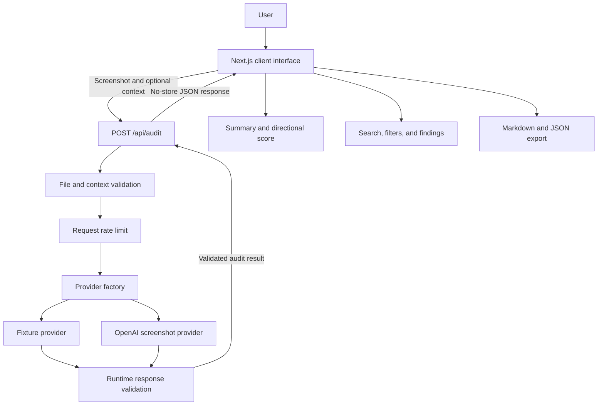

# Architecture Diagram

## Boundary explanation

- The browser owns file selection, local preview, form state, progress, report interaction, and client-side exports.
- The application route owns request validation, rate limiting, provider selection, safe error mapping, and response headers.
- Provider adapters own vendor-specific request and response handling.
- Runtime schemas protect the UI from malformed provider output.
- The fixture provider supports deterministic local development and tests without an external API key.
- External provider credentials remain server-side.

## Deliberate constraints

This architecture does not introduce a database, authentication, queue, distributed cache, or separate service because the portfolio MVP does not persist audits or require background processing.
